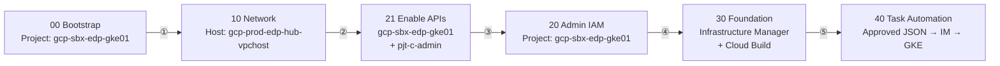
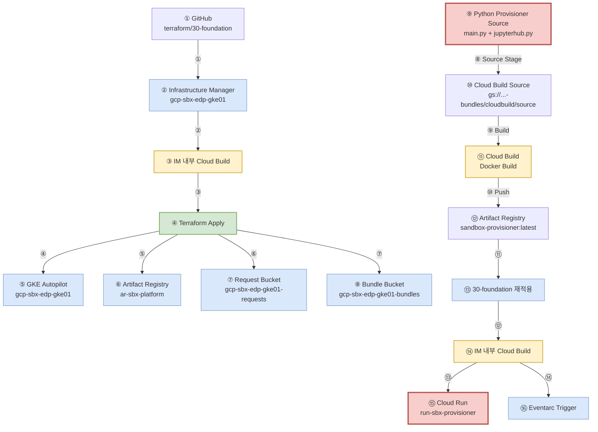
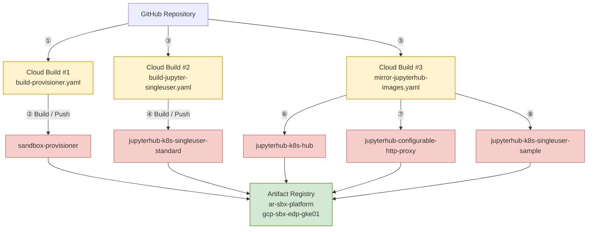
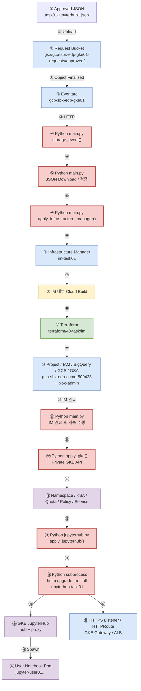

# GCP EDP Sandbox Platform - 4th Terraform Test

GKE Autopilot 기반 Sandbox 플랫폼을 Terraform, Infrastructure Manager, Cloud Build, Cloud Run Provisioner, Artifact Registry로 자동 구축하는 프로젝트입니다.

> 상세 구성도 및 실제 실행 흐름: **[docs/architecture-and-flow.md](docs/architecture-and-flow.md)**  
> IAM/실행 경계 상세: **[docs/execution-and-iam.md](docs/execution-and-iam.md)**

## 프로젝트 역할

| 프로젝트 | 역할 |
|---|---|
| `gcp-prod-edp-hub-vpchost` | Shared VPC Host, Subnet, NAT, ALB/Gateway 네트워크 |
| `gcp-sbx-edp-gke01` | GKE Autopilot, Cloud Run, Cloud Build, Artifact Registry, Infrastructure Manager, Eventarc |
| `gcp-sbx-edp-comn-509423` | task01 BigQuery/GCS/Jupyter GSA 등 Task 자원 |
| `pjt-c-admin` | 메인 Data Lake / BigQuery 원천 데이터 |

## 신규 구축 순서

**00 → 10 → 21 → 20 → 30 → 40**



## 실행 경계

| 순서 | Root | 실행 위치 | 인증 | 방식 |
|---:|---|---|---|---|
| 00 | `terraform/00-bootstrap` | `infra-son01` | `admin@sonmap.net` | 수동 Terraform |
| 10 | `terraform/10-network-host` | `infra-son01` | `admin@sonmap.net` | 수동 Terraform |
| 21 | `terraform/21-enable-apis` | `infra-son01` | `admin@sonmap.net` | Platform/Data API 활성화 |
| 20 | `terraform/20-admin-iam` | `infra-son01` | `admin@sonmap.net` | Service Account/IAM 구성 |
| 30 | `terraform/30-foundation` | `infra-son01`에서 요청 | VM SA → `sa-im-foundation` | Infrastructure Manager → 내부 Cloud Build → Terraform |
| 40 | `terraform/40-task/im` + Python | 자동화 | 단계별 전용 SA | Approved JSON → Eventarc → Cloud Run → IM → GKE |

VM 기본 서비스 계정은 `620081195575-compute@developer.gserviceaccount.com`입니다.

---

# 30 Foundation - 실제 흐름

30단계는 `terraform/30-foundation`을 Infrastructure Manager에 전달하고, Infrastructure Manager가 내부 Cloud Build 실행환경에서 Terraform을 수행합니다.

Cloud Run Provisioner는 별도 Cloud Build로 Docker 이미지를 생성하여 Artifact Registry에 Push한 뒤 30단계 자동화 자원에서 사용합니다.



---

# Artifact Registry - Build / Push 구조

현재 `ar-sbx-platform`에는 주요 이미지 5개가 있으며, Cloud Build 작업은 대략 3종류로 분리됩니다.



| 이미지 | 용도 |
|---|---|
| `sandbox-provisioner` | Cloud Run Python 자동화 |
| `jupyterhub-k8s-hub` | JupyterHub Hub Pod |
| `jupyterhub-configurable-http-proxy` | JupyterHub Proxy Pod |
| `jupyterhub-k8s-singleuser-standard` | 실제 사용자 Notebook Pod |
| `jupyterhub-k8s-singleuser-sample` | 테스트/샘플 이미지 |

---

# 40 Task - 실제 자동 처리 흐름

40단계의 실제 시작점은 Approved JSON입니다.

예:

```text
gs://gcp-sbx-edp-gke01-requests/approved/task01-jupyterhub1.json
```

Eventarc가 Cloud Run `run-sbx-provisioner`를 호출하고, Python `main.py`가 Infrastructure Manager 작업을 생성합니다. IM 내부 Cloud Build/Terraform이 완료된 후 Python이 다시 진행되어 GKE Private Endpoint에 접속하고 `jupyterhub.py`가 Helm으로 JupyterHub를 배포합니다.



### 색상 의미

| 색상 | 의미 |
|---|---|
| 빨강 | Python (`main.py`, `jupyterhub.py`) 수행 영역 |
| 녹색 | Terraform 수행 |
| 노랑 | Cloud Build 수행 |
| 파랑 | GCP 관리 자원 |
| 보라 | GKE/Jupyter Runtime |

---

## 디렉터리

```text
terraform/
├── 00-bootstrap/
├── 10-network-host/
├── 20-admin-iam/
├── 21-enable-apis/
├── 30-foundation/
└── 40-task/
    ├── 10-project/
    ├── 15-cloud-identity/
    ├── 20-project-iam/
    ├── 30-data/
    ├── 40-gke/
    ├── 50-loadbalancer/
    └── im/

cloudbuild/
├── build-provisioner.yaml
├── build-jupyter-singleuser.yaml
├── mirror-jupyterhub-images.yaml
└── sandbox-orchestrate.yaml

cloudrun-provisioner/
├── Dockerfile
├── main.py
├── jupyterhub.py
└── requirements.txt

docs/
├── architecture-and-flow.md
└── execution-and-iam.md
```

## 변수 파일 사용

| 단계 | Git 예제 파일 | 실제 실행 파일 |
|---:|---|---|
| 00 | `terraform.tfvars.example` | `terraform.tfvars` |
| 10 | `terraform.tfvars.example` | `terraform.tfvars` |
| 20 | `terraform.tfvars.example` | `terraform.tfvars` |
| 30 | `terraform.auto.tfvars.json.example` | IM Bundle의 `terraform.auto.tfvars.json` |
| 40 | Root별 예제 | Approved JSON에서 자동 생성/전달 |

## 안전 원칙

- Host Project API는 별도 스크립트로 필요한 항목만 활성화합니다.
- 21단계에서 Google 관리 Service Identity를 먼저 생성한 후 20단계 IAM을 적용합니다.
- 30 이후 사용자 ADC 및 `GOOGLE_OAUTH_ACCESS_TOKEN` 의존을 제거합니다.
- Infrastructure Manager Source는 승인된 commit SHA를 사용합니다.
- Terraform State, Plan, 인증키, 로컬 `terraform.tfvars`는 Git에 저장하지 않습니다.
- `gke-gmp-system`, `gke-managed-cim`, `kube-system`은 Autopilot 시스템 영역이므로 업무 Pod 중단 목적으로 삭제하지 않습니다.

## 상세 문서

- [Architecture & Execution Flow](docs/architecture-and-flow.md)
- [Execution and IAM](docs/execution-and-iam.md)
- [30 Foundation README](terraform/30-foundation/README.md)
- [40 Task README](terraform/40-task/README.md)
