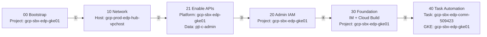
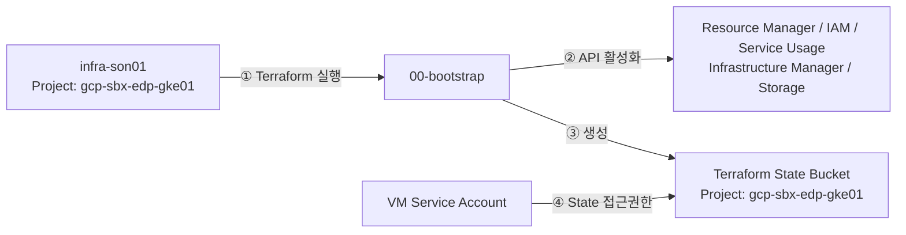
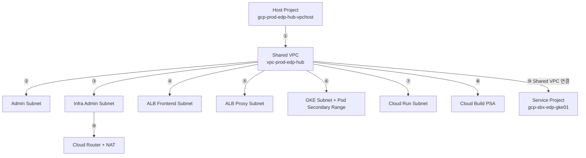
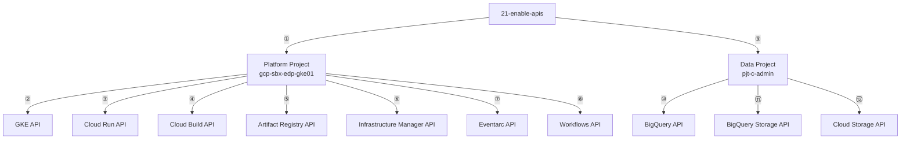
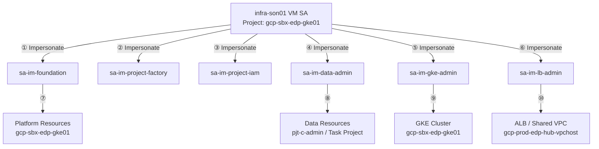
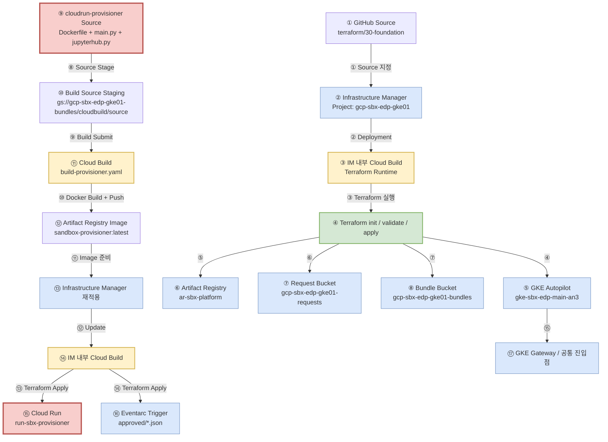
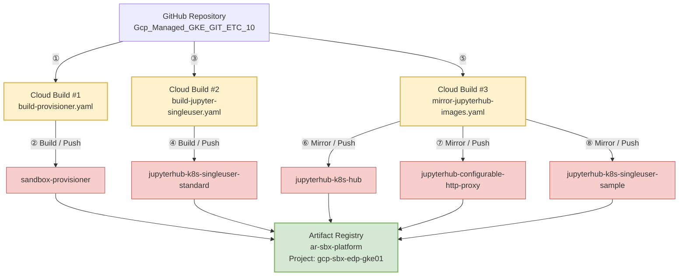
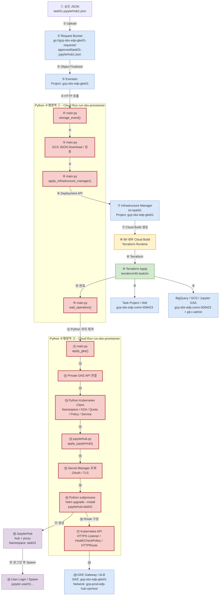
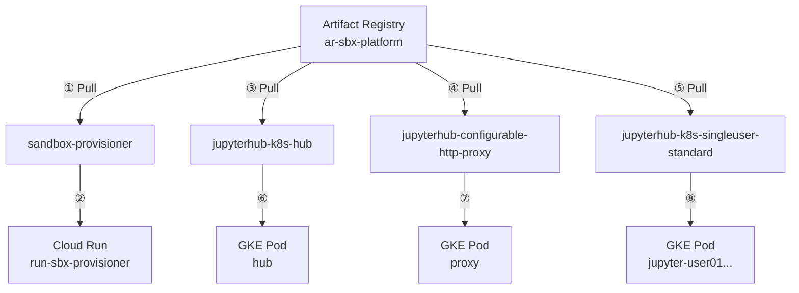

# GCP EDP Sandbox Platform - Architecture & Execution Flow

이 문서는 `Gcp_Managed_GKE_GIT_ETC_10`의 실제 실행 구조를 기준으로 00 → 10 → 21 → 20 → 30 → 40 단계와 Cloud Build, Infrastructure Manager, Artifact Registry, Cloud Run Python Provisioner, GKE/JupyterHub의 관계를 정리합니다.

> 신규 구축 순서: **00 → 10 → 21 → 20 → 30 → 40**

## 1. 프로젝트 역할

| 프로젝트 | 역할 |
|---|---|
| `gcp-prod-edp-hub-vpchost` | Shared VPC Host, Subnet, NAT, ALB/Gateway 네트워크 |
| `gcp-sbx-edp-gke01` | GKE Autopilot, Cloud Run, Cloud Build, Artifact Registry, Infrastructure Manager, Eventarc, Request/Bundle Bucket |
| `gcp-sbx-edp-comn-509423` | task01 BigQuery/GCS/Jupyter GSA 등 Task 데이터 자원 |
| `pjt-c-admin` | 메인 Data Lake / BigQuery 원천 데이터 |

## 2. 전체 단계 흐름



---

## 3. 00-bootstrap

Terraform 원격 State와 최소 Bootstrap API를 준비합니다.



---

## 4. 10-network-host

Shared VPC와 Platform 서비스가 사용할 공통 네트워크를 구성합니다.



---

## 5. 21-enable-apis

서비스 계정 및 Google 관리 Service Agent가 정상 생성될 수 있도록 Platform/Data API를 활성화합니다.



---

## 6. 20-admin-iam

Automation Service Account와 단계별 권한을 분리합니다.



---

# 7. 30-foundation - 실제 실행 순서

30단계는 GitHub의 `terraform/30-foundation`을 Infrastructure Manager에 전달하고, Infrastructure Manager가 내부 Cloud Build 실행환경을 사용하여 Terraform을 수행합니다.

30단계 후반에는 Cloud Run Provisioner 이미지를 별도로 Cloud Build하여 Artifact Registry에 Push한 뒤, 해당 이미지를 사용하도록 30-foundation을 다시 적용하여 Cloud Run/Eventarc 자동화 자원을 완성합니다.



## 7.1 30단계 색상 의미

| 색상 | 의미 |
|---|---|
| 빨강 | Python/Provisioner 관련 영역 |
| 녹색 | Terraform 수행 |
| 노랑 | Cloud Build 수행 |
| 파랑 | GCP 관리 자원 |

---

# 8. Artifact Registry 이미지 Build / Push 구조

`ar-sbx-platform`에는 현재 주요 이미지가 5개 있으며, 이미지 5개가 Cloud Build 5개를 의미하지는 않습니다. 현재 저장소에서는 대략 3종류의 Build/Mirror 작업으로 구성됩니다.

| Cloud Build 정의 | 결과 이미지 |
|---|---|
| `cloudbuild/build-provisioner.yaml` | `sandbox-provisioner` |
| `cloudbuild/build-jupyter-singleuser.yaml` | `jupyterhub-k8s-singleuser-standard` |
| `cloudbuild/mirror-jupyterhub-images.yaml` | `jupyterhub-k8s-hub`, `jupyterhub-configurable-http-proxy`, `jupyterhub-k8s-singleuser-sample` |



---

# 9. 40-task - 실제 실행 순서

40단계는 먼저 Provisioner 이미지가 준비되어 있어야 합니다. 이후 승인 JSON을 `gcp-sbx-edp-gke01-requests/approved/`에 업로드하면 Eventarc가 Cloud Run Python Provisioner를 호출합니다.

Cloud Run의 `main.py`가 Infrastructure Manager를 호출하고, IM 작업이 끝난 뒤 동일 Python 프로세스가 GKE Private Endpoint에 접속하여 Namespace/KSA/Quota 등을 적용하고, `jupyterhub.py`가 Helm을 실행하여 JupyterHub를 배포합니다.



## 9.1 40단계 핵심 실행 순서

```text
승인 JSON
  ↓
Request Bucket approved/
  ↓
Eventarc
  ↓
Cloud Run Provisioner
  ↓
Python main.py
  ↓
Infrastructure Manager
  ↓
IM 내부 Cloud Build
  ↓
Terraform 40-task/im
  ↓
Task Project / IAM / BigQuery / GCS / Jupyter GSA
  ↓
Python main.py 재개
  ↓
Private GKE API
  ↓
Namespace / KSA / Quota / NetworkPolicy
  ↓
Python jupyterhub.py
  ↓
Helm upgrade --install
  ↓
Hub / Proxy
  ↓
User Jupyter Pod
```

---

# 10. Artifact Registry Image 사용처

| 이미지 | 용도 | 실행 위치 |
|---|---|---|
| `sandbox-provisioner` | 승인 JSON 처리, IM 호출, GKE/JupyterHub 자동화 | Cloud Run |
| `jupyterhub-k8s-hub` | JupyterHub 중앙 Hub | GKE `hub` Pod |
| `jupyterhub-configurable-http-proxy` | 사용자 요청 Proxy | GKE `proxy` Pod |
| `jupyterhub-k8s-singleuser-standard` | 표준 사용자 Notebook | GKE `jupyter-user...` Pod |
| `jupyterhub-k8s-singleuser-sample` | 테스트/샘플 Notebook 이미지 | GKE 테스트 용도 |



---

# 11. 운영 시 주의사항

- `hub`, `proxy`는 Helm release `jupyterhub-task01`에서 관리됩니다.
- `kubectl scale ... --replicas=0`만 수행해도 이후 Provisioner/Helm 재적용 시 다시 `replicas=1`로 복구될 수 있습니다.
- `gke-gmp-system`, `gke-managed-cim`, `kube-system`은 GKE Autopilot 시스템 영역이므로 업무 중단 목적으로 삭제하지 않습니다.
- Infrastructure Manager 단계의 Cloud Build와 애플리케이션 이미지 빌드용 Cloud Build는 목적이 다릅니다.
- `gs://gcp-sbx-edp-gke01-bundles/cloudbuild/source`는 Build Source staging 용도이며, `gs://gcp-sbx-edp-gke01-requests/approved/`는 실제 Task 승인 트리거 입력 경로입니다.
