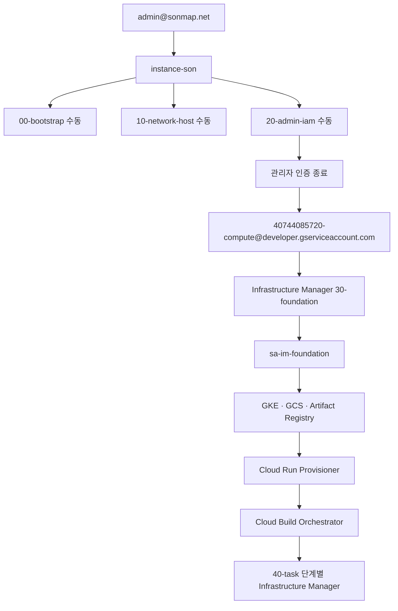

# 실행 계정과 권한 경계

## 흐름



## 관리자 단계

```bash
gcloud auth login admin@sonmap.net --no-launch-browser
gcloud config set account admin@sonmap.net
gcloud auth application-default login --no-launch-browser
```

00, 10, 20은 각각 독립 State prefix로 init하고 Plan의 삭제·교체 항목을 확인한 뒤 적용합니다.

## VM 서비스 계정 전환

```bash
unset GOOGLE_OAUTH_ACCESS_TOKEN
unset GOOGLE_APPLICATION_CREDENTIALS
gcloud auth application-default revoke
gcloud config set account 40744085720-compute@developer.gserviceaccount.com
gcloud auth list
gcloud config get-value account
```

## 30-foundation 실행

```bash
gcloud infra-manager deployments apply im-sbx-foundation \\
  --project=gcp-sbx-edp-gke01 \\
  --location=asia-northeast3 \\
  --service-account=projects/gcp-sbx-edp-gke01/serviceAccounts/sa-im-foundation@gcp-sbx-edp-gke01.iam.gserviceaccount.com \\
  --git-source-repo=https://github.com/sonmap/Gcp_Managed_GKE_GIT_ETC_10.git \\
  --git-source-directory=terraform/30-foundation \\
  --git-source-ref=APPROVED_COMMIT_SHA
```
