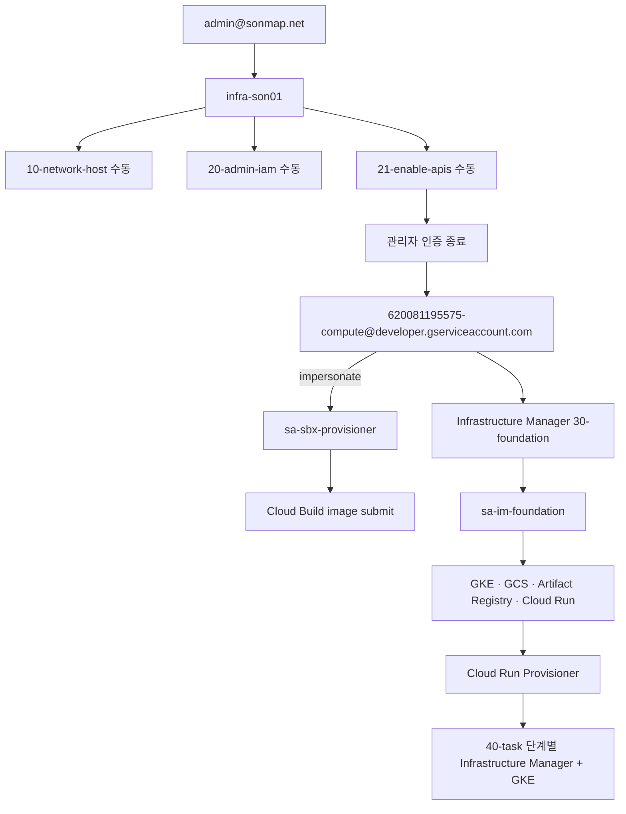

# 실행 계정과 권한 경계

## 흐름


```mermaid
flowchart TD
    U["admin@sonmap.net"] --> VM["infra-son01"]
    VM --> M10["10-network-host 수동"]
    VM --> M20["20-admin-iam 수동"]
    VM --> M21["21-enable-apis 수동"]
    M21 --> S["관리자 인증 종료"]
    S --> VMSA["620081195575-compute@developer.gserviceaccount.com"]
    VMSA -->|"impersonate"| PROV["sa-sbx-provisioner"]
    PROV --> BUILD["Cloud Build image submit"]
    VMSA --> IM["Infrastructure Manager 30-foundation"]
    IM --> FSA["sa-im-foundation"]
    FSA --> P["GKE · GCS · Artifact Registry · Cloud Run"]
    P --> RUN["Cloud Run Provisioner"]
    RUN --> TASK["40-task 단계별 Infrastructure Manager + GKE"]
```

## 관리자 단계

`admin@sonmap.net`은 현재 `10`, `20`, `21` 단계만 수행합니다.

```bash
gcloud auth login admin@sonmap.net --no-launch-browser
gcloud config set account admin@sonmap.net
```

- `10-network-host`: Shared VPC / subnet / NAT / firewall
- `20-admin-iam`: 자동화 Service Account와 IAM
- `21-enable-apis`: 필요한 Google APIs / Service Identity

각 단계는 독립 State prefix로 init하고 Plan의 삭제·교체 항목을 확인한 뒤 적용합니다.

## infra-son01 VM 서비스 계정

30단계 이후 운영 명령은 VM 기본 서비스 계정 기준으로 수행합니다.

```text
620081195575-compute@developer.gserviceaccount.com
```

Cloud Build source upload와 build submit은 VM SA가 직접 Storage 권한을 갖는 대신 `sa-sbx-provisioner`를 impersonate합니다.

```bash
gcloud builds submit . \
  --project=gcp-sbx-edp-gke01 \
  --region=asia-northeast3 \
  --config=cloudbuild/build-jupyter-singleuser.yaml \
  --substitutions=_REGISTRY=asia-northeast3-docker.pkg.dev/gcp-sbx-edp-gke01/ar-sbx-platform \
  --impersonate-service-account=sa-sbx-provisioner@gcp-sbx-edp-gke01.iam.gserviceaccount.com
```

`sa-sbx-provisioner`의 프로젝트 IAM은 `terraform/20-admin-iam/main.tf`에서 관리합니다. Cloud Build staging bucket 사용을 위해 `roles/storage.admin`, build submit을 위해 `roles/cloudbuild.builds.editor`, API 사용을 위해 `roles/serviceusage.serviceUsageConsumer`를 포함합니다.

## 30-foundation 실행

```bash
cd ~/Gcp_Managed_GKE_GIT_ETC_10
git pull --ff-only origin main
GIT_SHA=$(git rev-parse HEAD)

gcloud infra-manager deployments apply im-sbx-foundation \
  --project=gcp-sbx-edp-gke01 \
  --location=asia-northeast3 \
  --service-account=projects/gcp-sbx-edp-gke01/serviceAccounts/sa-im-foundation@gcp-sbx-edp-gke01.iam.gserviceaccount.com \
  --git-source-repo=https://github.com/sonmap/Gcp_Managed_GKE_GIT_ETC_10.git \
  --git-source-directory=terraform/30-foundation \
  --git-source-ref="${GIT_SHA}"
```

## 40-task 실행

40단계는 사용자가 Terraform을 직접 실행하지 않습니다.

```text
Approved JSON
  → Request Bucket
  → Eventarc
  → run-sbx-provisioner
  → im-taskXX
  → terraform/40-task/im
  → GKE / JupyterHub
```

Approved JSON의 `source.commit_sha`는 반드시 적용하려는 Git commit SHA와 동일해야 합니다.
